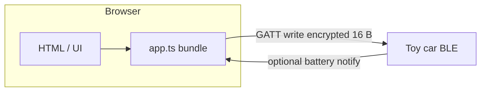

# bleshell · Shell Motorsport BLE (Web)

<p align="center">
  <strong>Browser-only proof-of-concept</strong><br />
  Drive a Shell Motorsport / Brandbase <strong>QCAR</strong>-style toy car over <strong>Bluetooth Low Energy</strong> using the <strong>Web Bluetooth API</strong>.
</p>

<p align="center">
  <a href="https://developer.chrome.com/docs/capabilities/web-apis/web-bluetooth">Web Bluetooth</a>
  ·
  <a href="https://github.com/luchojuarez/shell-car-remote">shell-car-remote</a> (protocol reference)
</p>

---

## Why this exists

There is **no server**: you open a static page, pair the car from Chromium, and drive.  
The wireless protocol (16-byte **CTL** frames + **AES-128-ECB**) matches the reverse-engineered flow used in [`shell-car-remote`](https://github.com/luchojuarez/shell-car-remote) — this repo reimplements that piece in **TypeScript** for the browser.



---

## Requirements

| Requirement | Notes |
|-------------|--------|
| **Browser** | Chromium-based: Chrome, Edge, Brave, etc. |
| **Transport** | **HTTPS** or **localhost** (Web Bluetooth security policy) |
| **OS** | Desktop Linux / macOS / Windows with a working Bluetooth adapter |
| **Build** | Node.js (for `npm install` + esbuild) |
| **Serve** | Python 3 (`make serve`) or any static file server |

---

## Quick start

```bash
git clone <your-repo-url> bleshell
cd bleshell
make start
```

Then open **http://127.0.0.1:8765/** and use **Pair & connect**.

| Target | Command |
|--------|---------|
| Build only | `make build` → installs deps and writes `dist/app.js` |
| Serve only | `make serve` (assumes `dist/` already built) |
| Build + serve | `make start` |

During development:

```bash
npm run watch
```

Rebuilds `dist/app.js` whenever `src/` changes (run a static server in another terminal).

---

## Controls

### On-screen & keyboard

| Action | Touch / mouse | Keyboard |
|--------|-----------------|----------|
| Forward / back / steer | D-pad buttons | `WASD` or arrow keys |
| Turbo | Turbo button | `Shift` |
| Lights | Lights button | `L` |

### Gamepad (standard mapping)

| Action | Input |
|--------|--------|
| Drive | **Left stick** or **D-pad** (buttons 12–15) |
| Turbo | **L1**, **R1**, or **RT** &gt; ~40% |
| Lights | **Y / △** (button 3) or **PS-style** (16 / 17) — toggles on press |

---

## Tech stack

| Piece | Role |
|-------|------|
| **TypeScript** | Source in `src/` |
| **esbuild** | Bundles `src/app.ts` → `dist/app.js` (IIFE, global `ShellCarPOC`) |
| **aes-js** | AES-128-ECB on 16-byte blocks (car protocol) |
| **@types/web-bluetooth** | TypeScript typings for Web Bluetooth |
| **Python** `http.server` | Local static hosting via Makefile |

---

## Protocol (summary)

Details live in [`src/protocol.ts`](src/protocol.ts).

| Item | Value |
|------|--------|
| GATT service | `0000fff0-0000-1000-8000-00805f9b34fb` |
| Drive characteristic | `d44bc439-abfd-45a2-b575-925416129600` |
| Battery notify (optional) | `d44bc439-abfd-45a2-b575-925416129601` |
| Payload | 16-byte plaintext **CTL** frame → AES-128-ECB → `writeValueWithoutResponse` |

The bundled script sends drive frames at roughly **10 ms** intervals while connected, similar to the Go reference client.

---

## JavaScript API

After loading `dist/app.js`, a global **`ShellCarPOC`** object is available:

| Member | Description |
|--------|-------------|
| `connect()` | Opens the device picker and connects over GATT |
| `disconnect()` | Disconnects |
| `getBatteryLabel()` | Last known battery label string (if notifications work) |

The page wires these to buttons automatically; you can also call them from the devtools console.

---

## GitHub Pages

`dist/` is not committed (see `.gitignore`). Use the included workflow so Pages always gets a fresh build.

1. Create a repository on GitHub and push this project (`main` or `master`).
2. In the repo: **Settings → Pages → Build and deployment**.
3. Under **Source**, choose **GitHub Actions** (not “Deploy from a branch”).
4. Push to `main` / `master` (or run the workflow manually under **Actions**). The workflow in [`.github/workflows/pages.yml`](.github/workflows/pages.yml) runs `npm ci`, `npm run build`, then publishes `index.html` and `dist/`.

Your site will be available at:

`https://<username>.github.io/<repository>/`

GitHub serves it over **HTTPS**, which satisfies Web Bluetooth’s secure-context requirement (same as `localhost`).

---

## Troubleshooting

- **“Web Bluetooth is not available”** — Use Chromium over HTTPS or `http://127.0.0.1` / `http://localhost`.
- **Car does not appear** — It must advertise the FFF0 service (or widen filters in code if your device only advertises by name).
- **No `dist/app.js`** — Run `make build` before serving.

---

<p align="center">
  Built for tinkering with tiny BLE cars · Not affiliated with Shell or toy manufacturers.
</p>
